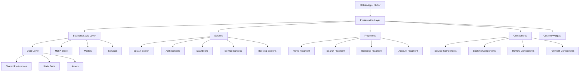
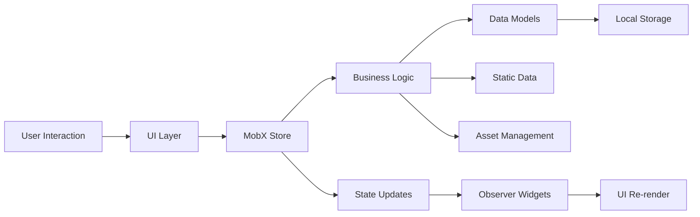
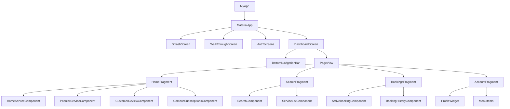
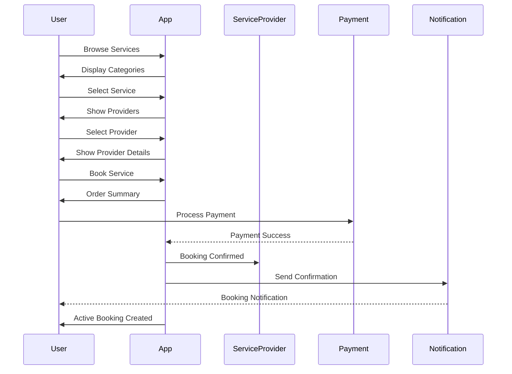
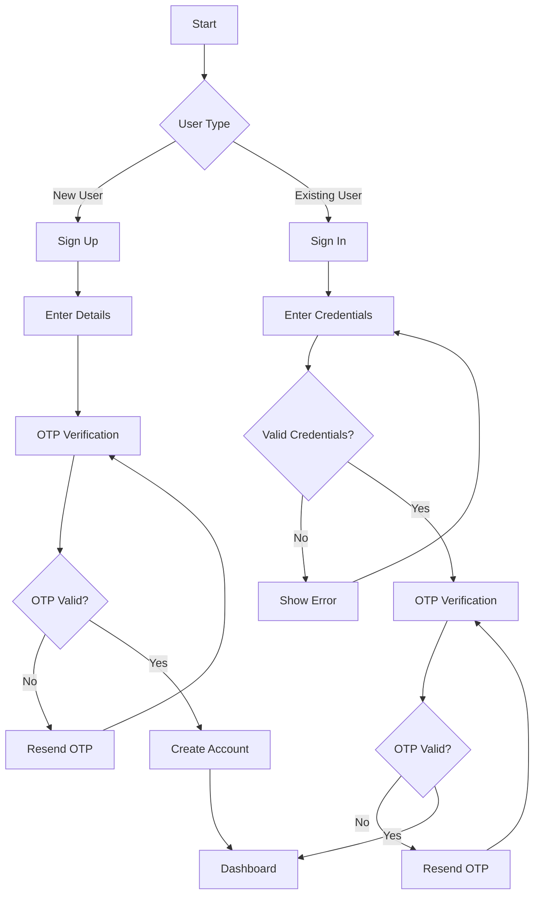
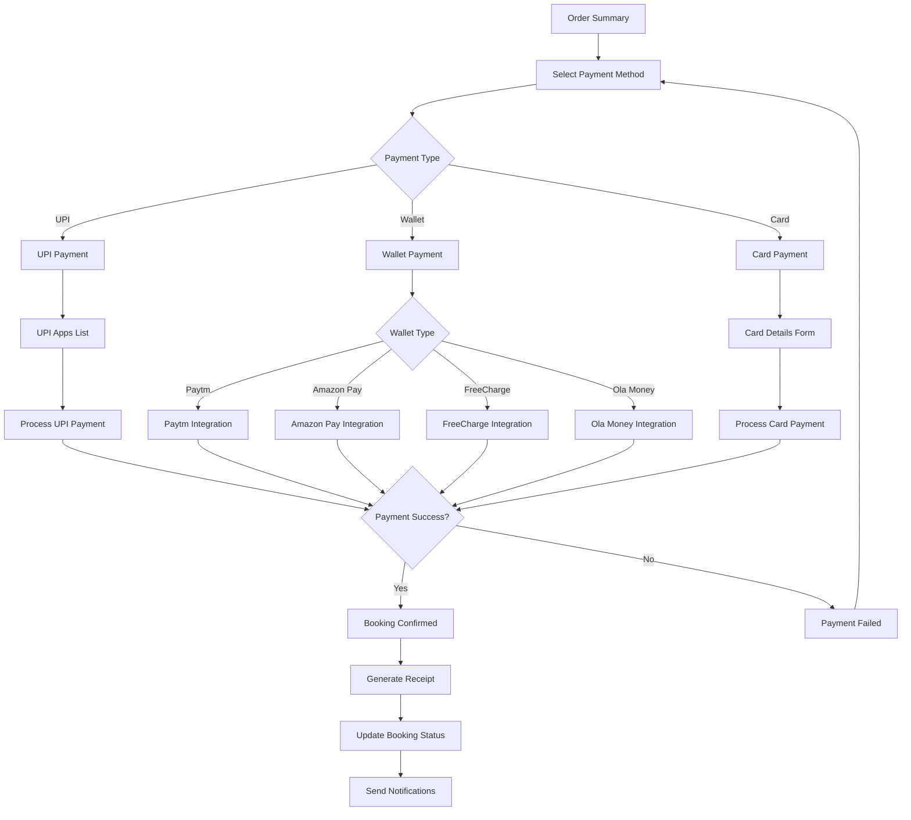
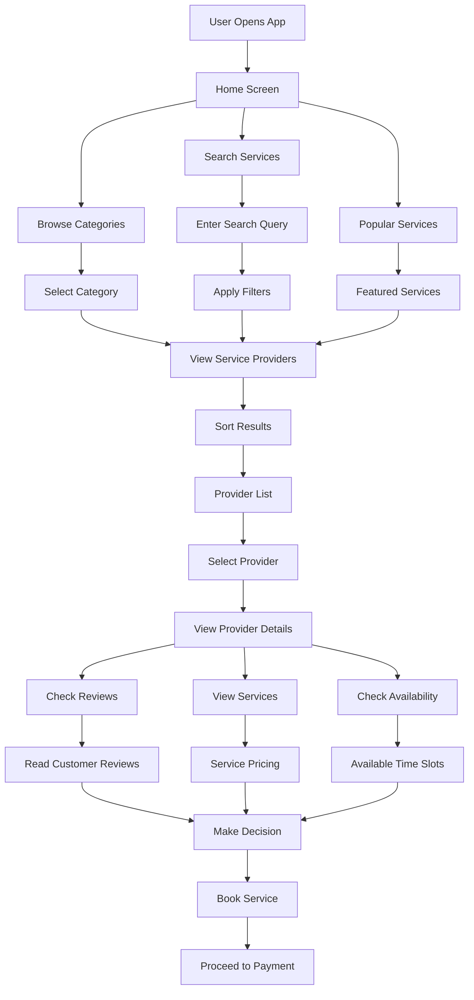
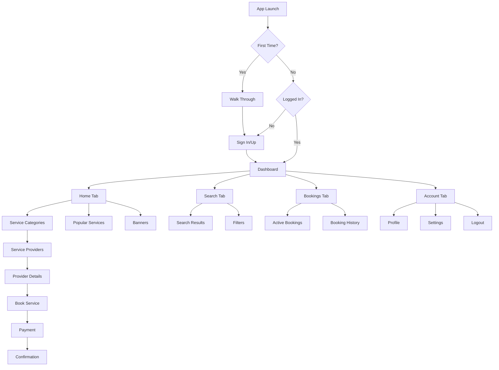

# Architecture Diagrams - Home Service App

## System Architecture Overview

## Data Flow Architecture

## Component Hierarchy

## Booking Process Flow

## Authentication Flow

## Payment Integration Flow

## Service Discovery Flow

## Navigation Flow

